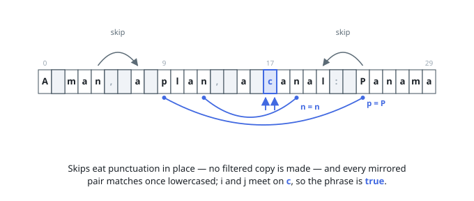

# Solutions — Valid Palindrome

## Two pointers, walk inward

The statement normalizes the phrase first — lowercase everything, drop every non-alphanumeric character — and then asks whether the result reads the same forward and backward. Meeting in the middle replaces that rewrite: walk one pointer from each end, and the phrase is a palindrome exactly when every mirrored pair of surviving characters agrees.

Each pointer skips what the rules erase. While it sits on punctuation or a space, the normalization would delete that character, so it can never break the mirror and the pointer steps past it. Once both pointers rest on alphanumeric characters, a single comparison of lowercased characters applies the case rule in place; digits lower to themselves, so the same comparison covers both kinds. The first disagreement returns false, and when the pointers meet every pair has agreed and true is returned. An empty or all-punctuation input never offers a pair to compare, so it falls through to true.

The scan visits each character at most once and holds only two indices, so no filtered copy of `s` is ever materialized — at `2 * 10⁵` characters that headroom is what keeps the pass comfortably inside the time limit.

**Complexity:** `O(n)` time, `O(1)` space.
