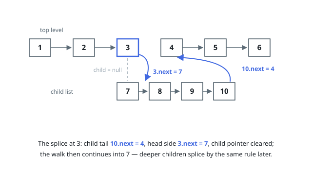

# Solutions — Flatten a Multilevel Doubly Linked List

## Iterative splice-on-encounter

Walk the top level node by node. A node without a `child` needs nothing —
step to `next`. A node with a `child` gets its child list spliced in right
where it stands: find the child chain's tail with a straight walk, wire
that tail's `next` to the node's old `next` (patching the old next's
`prev` back-link when it exists), then rewire the node's `next` to its
child and the child's `prev` to the node, clearing the `child` pointer —
the flattened list must carry no child links anywhere.

After the splice the walk simply continues from the child, so whatever the
child chain contains — including its own deeper children — is encountered
in order and flattened by the same rule. No recursion and no auxiliary
stack: each level is absorbed the moment the walk reaches it, and the loop
terminates on the final level's trailing `null`. An empty input head is
returned untouched (`[]` on the wire).

Every node is visited once by the outer walk; each child chain's tail is
found once, and the tail scan never re-reads spliced nodes more than once
per nesting level they pass through.

**Complexity:** O(n²) worst case (a ladder where every splice rescans),
O(n) on typical shapes; O(1) extra space.
