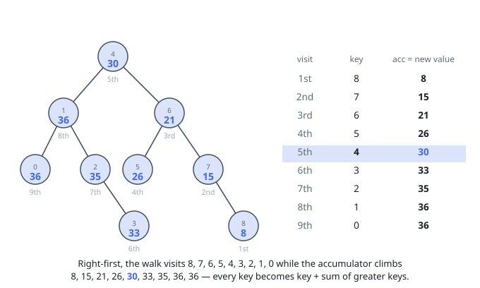

# Solutions — Convert BST to Greater Tree

## Reverse inorder with a running sum

Reverse inorder — right subtree, node, left subtree — visits a BST's keys in
strictly descending order, which is exactly the order this transformation
needs: by the time the walk reaches a key, every key greater than it has
already been visited. A single accumulator holding the sum of everything seen
so far therefore answers each node on arrival — after adding the node's own
key it equals the original key plus the sum of all greater keys, so the walk
writes it straight back as the node's new value and moves on. No second pass,
no per-node search through the rest of the tree.

The rewrite happens in place, one value per visit, and the structure is never
touched — the returned tree is the input tree with every key replaced. The
traversal carries its own stack of nodes rather than recursing: the input may
be a single 10^4-node chain, whose walk would nest 10000 calls — past
CPython's default recursion limit and over the 512k stacks the judge hands
Java and Node — so every runtime iterates instead.

The accumulator is bounded by the sum of the tree's keys, and the constraints
pin that down: values lie in `[-10^4, 10^4]` and are unique, so no total ever
passes 50005000 in magnitude — an i32 holds it with two orders of magnitude
to spare.

**Complexity:** `O(n)` time, `O(h)` space for the explicit traversal stack,
where `h` is the tree's height.
