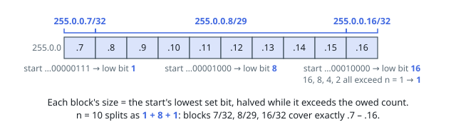

# Solutions — IP to CIDR

Covering an address range with CIDR blocks is a left-to-right greedy. The
first block must start at `ip`, and each block after it must start where the
previous one ended, so the answer is built by repeatedly taking the largest
block available at the current address — and that choice is forced at every
step, which makes the shortest covering list unique and the greedy
deterministic.

## Largest Aligned Block

Parse `ip` into its 32-bit integer value `x` and keep the remaining count
`n`. A block holding `2^k` addresses may start only at an address divisible
by `2^k`, and it may not hold more than the `n` addresses still owed. The
largest block satisfying both is therefore the lowest set bit of `x` — the
address's own alignment — shrunk by halving until it fits under `n`. Address
`0` has no set bit: the whole `2^32` space aligns there, so only the count
caps the block. Emit `x` in dotted-decimal with prefix `32 - log2(block)`,
advance `x` by the block, and take the block off `n`; when the count runs
out, the emitted sizes have summed to exactly the requested range and cover
nothing outside it.

The arithmetic keeps the address in a 64-bit integer even though addresses
fit in 32 bits, because the alignment cap at address `0` is the full `2^32`
— one past what an unsigned 32-bit type can hold. The loop does constant
work per emitted block (the halving runs at most 32 steps), so the block
count drives the cost.

**Complexity:** `O(n)` time, `O(n)` space.
