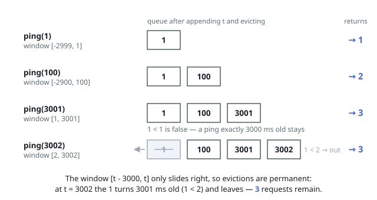

# Solutions — Number of Recent Calls

Each `ping` asks for the size of one window over the arrival history, and the
guarantee that `t` is strictly increasing is exactly what lets a single queue
carry the whole design: the window's left edge only ever moves right, so pings
can be retired permanently as they fall out of it.

## Queue of Ping Times

The counter keeps a queue of the ping times that are still inside some live
window, oldest first. `ping(t)` appends `t`, then evicts from the front while
the oldest time lies strictly below the current window's left edge `t - 3000`;
what survives, together with `t` itself, is exactly the set of requests in the
inclusive range `[t - 3000, t]`, so the answer is the queue's size. The
inclusive right end needs no check of its own — `t` was just appended — and the
inclusive left end is what the strict `<` comparison buys: a ping exactly 3000
milliseconds old stays, one 3001 old goes.

Eviction is safe to do destructively because `t` never decreases: a time below
`t - 3000` is below `t' - 3000` for every later ping `t'` as well, so nothing
evicted now can belong to a future window — the queue really is the complete
set of candidates, not just the ones convenient to keep. Since each ping enters
and leaves the queue at most once, all the eviction work across a whole session
is bounded by the number of pings, and a single call does `O(1)` work
amortized even when it evicts nothing.

**Complexity:** `O(1)` amortized per ping, `O(n)` space.
