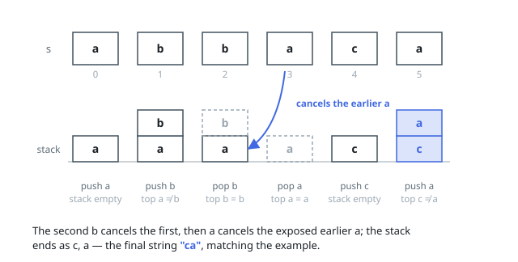

# Solutions — Remove All Adjacent Duplicates In String

## Single-pass stack

Walk `s` once, maintaining a stack of characters that have not yet been
cancelled. For each character, compare it against the stack's top: if
they are equal, the pair is a duplicate removal, so pop the top instead
of pushing (the two letters cancel). Otherwise push the character.

Because a cancellation can bring two previously non-adjacent letters
together, the stack's top after a pop is automatically the new
neighbor for the next character, so cascading removals fall out of the
same rule without any extra bookkeeping or restarting the scan. Joining
the stack's contents at the end produces the final string.

**Complexity:** `O(n)` time, `O(n)` space.
