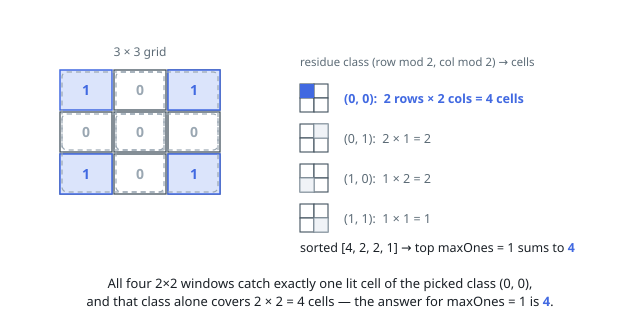

# Solutions — Maximum Number of Ones

## Residue Classes and Their Frequencies

Every square sub-matrix of size `sideLength × sideLength` covers each
residue class `(r mod side, c mod side)` exactly once: its cells have
distinct row remainders and distinct column remainders. That single fact
restructures the whole problem. Any valid matrix, restricted to one residue
class, uses at most `maxOnes` classes in total per window — so the
constraint binds _classes_, not individual cells.

It follows that an optimal matrix can be assumed periodic with period
`sideLength`: if a cell is 1, setting every cell sharing its residue pair
to 1 adds copies only in windows that already counted this class — no
window exceeds `maxOnes` ones. So the matrix is fully described by choosing
_which_ `maxOnes` of the `side²` classes are lit, and each choice earns a
number of ones equal to how many grid positions fall into those classes.

Counting is then plain arithmetic. Class `(r, c)` appears in every row
whose index is ≡ r (mod side) — that is `height ÷ side` rows, plus one more
when `height mod side > r`, because the leftover strip reaches remainder
`r`. The same for columns with `width`. Multiply the two to get the class's
frequency, sort all `side²` frequencies descending, and sum the largest
`maxOnes` — the greedy pick is safe since classes contribute
independently.

**Complexity:** `O(side² log side)` for the frequency table and sort,
`O(side²)` space.
