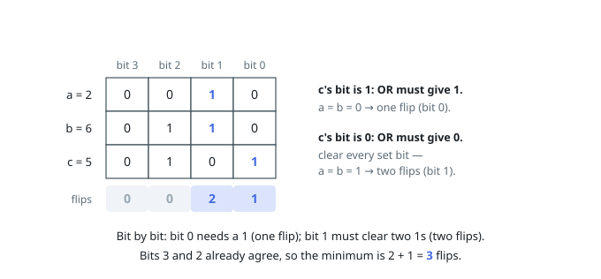

# Minimum Flips to Make a OR b Equal to c

## Approach: Per-bit accounting

Flips on different bit positions are independent, so the minimum total is
the sum of per-bit minima. For a bit where `c` has a 1, the OR must
produce 1: if both `a` and `b` carry 0 there, exactly one flip (either
operand) suffices. For a bit where `c` has a 0, the OR must produce 0:
every set bit among `a` and `b` at that position must be cleared, costing
one flip each — two when both are set.

Walking the three numbers one bit at a time (shifting until all three are
exhausted, so `c`'s high bits are not missed) accumulates exactly that
count. The loop runs at most 31 iterations for values up to 10⁹.

**Complexity:** O(log max(a, b, c)) time, O(1) space.
