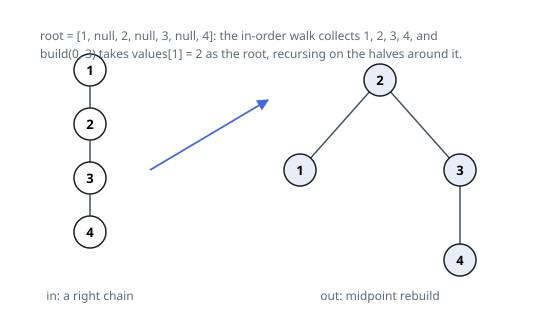

# Solutions — Balance a Binary Search Tree

Both approaches return a balanced search tree over the same values, but they part ways on how much extra memory the job costs. The midpoint rebuild spends an explicit array holding every value, then allocates a brand-new node per position. The mirrored Day-Stout-Warren rotation allocates nothing at all: it reshapes the tree's own existing nodes in place through a sequence of rotations, so the whole rebalance runs inside the input's own pointers.

## In-order traversal plus midpoint rebuild

The values of any BST come out sorted under in-order traversal, and conversely any sorted array can be turned into a balanced BST by choosing the middle element as the root and recursing on the two halves — each split puts at most half the remaining values on either side, so every node's subtrees differ in depth by no more than one. The plan is therefore a two-phase rebuild: flatten, then reassemble.

Phase one is an iterative in-order walk with an explicit stack: keep descending left, pushing nodes; when the descent bottoms out, pop a node, record its value, and continue from its right child. This avoids recursion-depth limits for degenerate inputs of up to `10^4` nodes (an input that is itself a straight line is exactly the unbalanced case the problem feeds in) and produces the values in ascending order.

Phase two is the recursive `build(lo, hi)`: take `mid = (lo + hi) // 2` as the new node, build the left child from `values[lo..mid-1]` and the right from `values[mid+1..hi]`, returning `None` when the range empties. Its recursion depth is `O(log n)`, so it is safe even though phase one was made iterative. The result is a brand-new tree containing the same values as the input, which the problem explicitly permits ("return any" balanced tree with the same values).

Edge cases: a single-node tree rebuilds to itself, and the smallest case (`n = 1`) never recurses. The traversal allocates the value list and the new nodes — both linear.

**Complexity:** `O(n)` time, `O(n)` space.

## Mirror Day-Stout-Warren Rotation

The Day-Stout-Warren algorithm balances a binary search tree by two in-place passes over its own nodes: first straighten it into a sorted linked list (a "vine"), then fold that vine into a complete shape with rotations. This mirrors the textbook version end for end — vine and compression both run right to left instead of left to right — which still produces a valid balanced tree over the same values, though not always the identical shape the midpoint rebuild picks (the statement says to return any of them).

Building the vine walks down through a dummy head, always inspecting the node currently in hand: a node with a right child gets a left rotation — its right child is promoted above it and inherits it as a left child — which shortens the remaining tree by one and keeps the walk at the same spot to check again; a node with no right child is finished, so the walk steps onto its left child and the vine's length counter grows by one. When the walk runs out of nodes, every node hangs off the next by a left pointer alone, in strictly descending value order.

Compression folds that vine upward with right rotations, which are the mirror image of the left rotations used to build it: every second node along the vine is promoted above its neighbor, halving the vine's length each pass. The first pass only promotes the vine's excess over the largest `2^k - 1` size that fits, so every later pass halves a size that is already one short of a power of two and finishes evenly. The result is a tree balanced the same way the midpoint rebuild produces — depths across any node's two subtrees differ by at most one — while reusing the input's own nodes throughout, so the whole job costs no extra memory beyond a few pointers.

**Complexity:** `O(n)` time, `O(1)` space.
