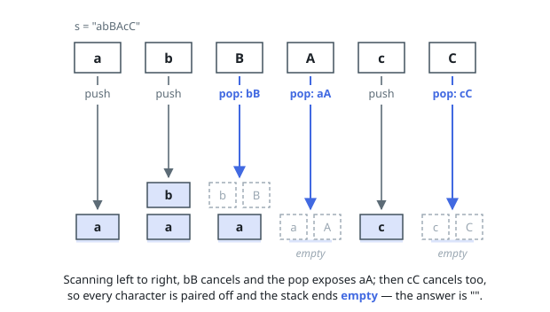

# Solutions — Make The String Great

## Single-pass stack

A bad adjacent pair is the same letter in opposite case sitting next to
each other, and removing one such pair can expose a new bad pair between
the characters that used to flank it. That "new neighbors meet" pattern is
exactly what a stack captures: keep the characters kept so far on a stack,
and for each new character compare it only against the top.

If the top cancels with the current character — same letter, different
case — pop it instead of pushing; otherwise push the current character on
top. Because the stack only ever holds characters that have already
survived every earlier cancellation, the character directly below the top
is never adjacent to anything but the top itself, so checking just the top
is enough to reproduce the effect of repeatedly scanning for and removing
bad pairs anywhere in the string, regardless of which pair got removed
first. Joining the final stack gives the good string.

**Complexity:** `O(n)` time, `O(n)` space.
