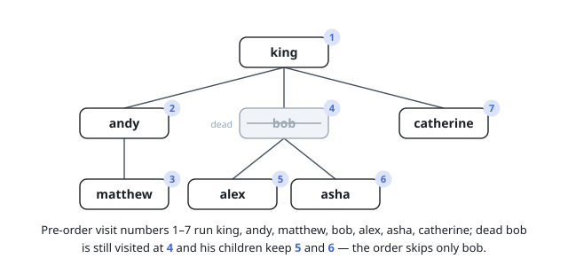

# Solutions — Throne Inheritance

## Family Tree With Pre-Order DFS

The family is stored as an n-ary tree keyed by name: a hash map from a
person's name to the list of their children, kept in birth order,
because `birth` always appends the new child to its parent's list. A
second hash set records who has died. `death` never touches the tree
shape at all — it only flips a person's membership in that set, which
is exactly what the problem means by "doesn't affect the Successor
function nor the current inheritance order."

`getInheritanceOrder` reconstructs the Successor walk directly:
without deaths, that recursive rule is just a pre-order traversal —
visit a person, then recurse into each child oldest-first before moving
to the next sibling. The implementation runs that traversal iteratively
with an explicit stack (never language recursion), since up to `10^5`
births can chain the tree `10^5` generations deep and a recursive walk
would risk overflowing the call stack. Each person's children are
pushed in reverse order so the oldest child is popped, and therefore
visited, first; a dead person is popped and skipped from the output
exactly like everyone else, but their children are still pushed and
still appear at their correct nested position.

Because `birth` and `death` only ever touch one map entry or one set
entry, both run in constant time regardless of how large the tree has
grown; the traversal is the only operation that scans the whole tree,
and it is only called up to ten times.

**Complexity:** `birth` and `death` `O(1)` time; `getInheritanceOrder`
`O(n)` time for a tree of `n` people; `O(n)` space for the tree and the
dead set.
