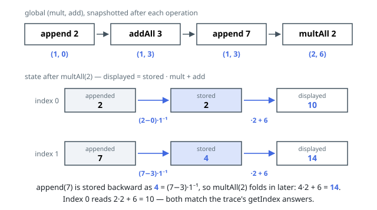

# Solutions — Fancy Sequence

## Lazy global transform with a modular-inverse append

`addAll` and `multAll` never touch the stored elements directly. Instead
the sequence tracks one running pair `(mult, add)` that represents the
affine map every already-appended value has accumulated so far: its
current value is `stored * mult + add (mod 10⁹ + 7)`. `addAll(inc)` folds
in by setting `add = add + inc`; `multAll(m)` scales both fields at once —
`mult = mult * m` and `add = add * m` — since multiplying `stored * mult +
add` by `m` distributes over both terms. Both operations become `O(1)`,
regardless of how many elements exist.

The subtlety is `append`: a freshly appended value must read back exactly
as given, even though the running `(mult, add)` pair already reflects
every prior `addAll`/`multAll` call and will keep evolving afterward. The
fix is to store the value transformed _backward_ through the current map —
`stored = (val - add) * mult⁻¹ (mod 10⁹ + 7)` — so that later applying the
(by-then-different) `(mult, add)` pair to it reproduces `val` at the
instant it was appended, and correctly picks up every transform applied
after that point. The modular inverse is computed by Fermat's little
theorem, `mult^(MOD-2) mod MOD`, which is valid because `MOD` is prime and
`mult` is a product of factors in `1..100`, so it can never be `0 mod
MOD`. `getIndex` then just evaluates `stored[idx] * mult + add (mod 10⁹ +
7)`, or `-1` when `idx` falls outside the current length.

**Complexity:** `append`, `addAll`, `multAll`, and `getIndex` each run in
`O(1)` time (the modular exponentiation in `append` is `O(log MOD)`); `O(n)`
space for `n` appended elements.
