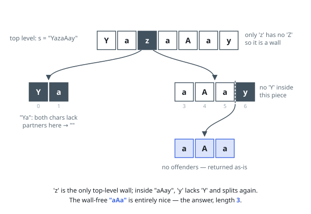

# Solutions — Longest Nice Substring

A character whose case-partner is missing from the entire string can
never sit inside a nice substring: every window containing it fails
its niceness check. Such characters act as walls, and the answer must
live entirely within one wall-free segment.

## Divide on missing case-partners

Scan the whole string once to collect the set of characters present.
Any character whose swapped-case twin is absent from that set is an
offender — split the string at every offender and recurse on the
pieces. A segment with no offenders is entirely nice and is returned
as-is. Among the recursive results the longest wins, with earlier
segments preferred on ties (comparing left-first with `>=` preserves
the earliest-occurrence rule). Recursion depth is bounded by the
alphabet: each level removes at least one letter entirely, so at most
26 splits can occur on any path; with `n <= 100` the whole search is
tiny.

On `"YazaAay"` only the character 'z' (no 'Z' anywhere) is an
offender, splitting out `"aAa"` — nice, length 3. On `"Bb"` both
partners are present, so the whole string is the answer. A single
character has no partner and yields the empty string.

**Complexity:** `O(26 * n)` segment scans worst case, effectively
`O(n)` per level with at most 26 levels; `O(n)` space.
