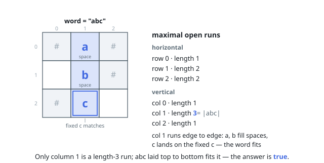

# Solutions — Check if Word Can Be Placed In Crossword

## Scan maximal open runs

Blocks and board edges are exactly the legal boundaries of a placement, so scan every maximal horizontal and vertical run of cells that are not `'#'`. A run can hold the word only when its length equals the word length; shorter runs do not fit, and longer runs would leave a letter or space directly before or after the placement.

For each correctly sized run, compare its fixed letters with `word` in both directions. A cell containing `' '` accepts either letter, while any lowercase letter must match the corresponding forward or reversed character. The scans use indices rather than splitting rows, so leading, trailing, and consecutive spaces remain intact.

**Complexity:** `O(m * n)` time, `O(1)` auxiliary space.
