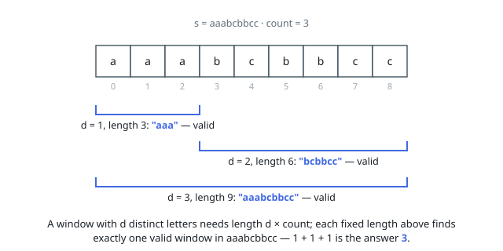

# Solutions — Number of Equal Count Substrings

## Fixed windows for each distinct-letter count

If an equal count substring contains `d` distinct letters, its length must be `d * count`. Try every `d` from 1 through 26 and slide a window of that fixed length, stopping once the required length exceeds the string.

Maintain the 26 frequencies, the number of letters present in the window, and the number whose frequency equals `count`. Before and after each frequency change, update those two counters; a window is valid exactly when both counters equal `d`, which also rejects windows containing an extra letter above or below the required frequency.

**Complexity:** `O(26n)` time and `O(26)` space.
