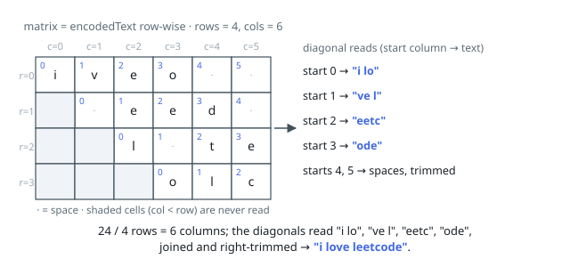

# Solutions — Decode the Slanted Ciphertext

## Read the matrix diagonally

The encoded string is the matrix flattened row by row, so its column count is `len(encodedText) / rows`. Start once in every column of the top row; from starting column `c`, move down and right through `(row, c + row)` while the column remains in bounds, appending the character at row-major index `row * cols + c + row`.

These diagonals reproduce the placement order of the original text. Padding can occur only after its final character, so remove trailing spaces from the accumulated result while leaving every internal space intact; an empty encoded string directly produces an empty result.

**Complexity:** `O(n)` time and `O(n)` output space, where `n` is the encoded length.
