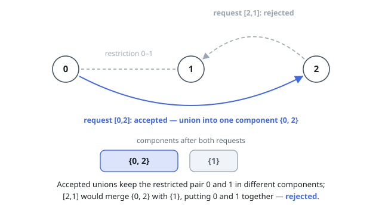

# Solutions — Process Restricted Friend Requests

## Validate each union against the restrictions

Maintain the accepted friendship components with a disjoint-set union structure. For a request, find the two current roots and scan every restriction. The request is invalid exactly when one restricted endpoint belongs to the first component and the other belongs to the second, in either orientation. Otherwise, union the components and record `true`; a request inside an existing component is safe and remains successful.

This invariant keeps every restricted pair in different components after each accepted request. Path compression and union by size make each root operation amortized nearly constant, while the restriction scan is bounded by the input size.

**Complexity:** `O(Q * R * alpha(n))` time and `O(n)` extra space, where `Q` is the number of requests and `R` is the number of restrictions.
