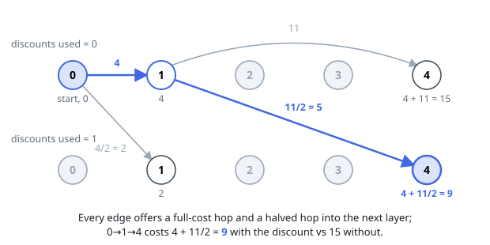

# Solutions — Minimum Cost to Reach City With Discounts

## Dijkstra over discount states

Treat `(city, used)` as a state, where `used` is the number of discounts spent. Traversing a highway of toll `t` always offers a full-cost edge to `(neighbor, used)`, and when another discount is available it also offers an edge of cost `floor(t / 2)` to `(neighbor, used + 1)`. All edge costs are nonnegative, so Dijkstra finalizes these expanded states in increasing total cost; the first state removed for city `n - 1` is optimal regardless of how many discounts remain unused.

Use 64-bit internal distances because tentative routes can exceed 32-bit range. The returned optimum fits 32 bits: when a route exists, a simple path uses at most `n - 1` highways, each costing at most `10⁵`, so even without discounts it costs at most `(n - 1) · 10⁵ < 10⁸`.

**Complexity:** `O((nD + mD) log(nD))` time and `O(nD + m)` space, where `D = discounts + 1`.
