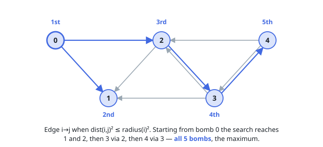

# Solutions — Detonate the Maximum Bombs

## Search the directed reachability graph

Create a directed edge from bomb `i` to bomb `j` when the squared distance between their centers is at most the square of bomb `i`'s radius. Squared 64-bit arithmetic avoids floating-point comparisons and overflow.

Run a graph search from every possible initial bomb and retain the largest number of reached vertices.

**Complexity:** `O(n³)` time and `O(n²)` space.
