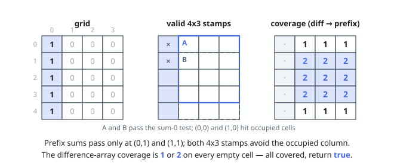

# Solutions — Stamping the Grid

## Find every valid stamp and accumulate its coverage

Build a two-dimensional prefix sum of occupied cells. It tests any stamp-sized rectangle in constant time, so enumerate every top-left position and keep exactly the rectangles whose occupied-cell sum is zero. Add each valid rectangle to a two-dimensional difference array using four corner updates.

Prefix-sum the difference array to recover how many valid stamps cover each cell. The placement is possible exactly when every empty cell has positive coverage; overlapping all valid stamps is safe because none covers an occupied cell.

**Complexity:** `O(m * n)` time and `O(m * n)` auxiliary space.
