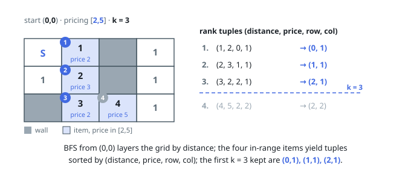

# Solutions — K Highest Ranked Items Within a Price Range

## Breadth-first distances and tuple ranking

Run breadth-first search from `start` through every non-wall cell, recording each shortest distance. Whenever a reached cell contains an item inside the inclusive price range, store its rank tuple `(distance, price, row, column)`.

Sort the candidates lexicographically by that tuple, keep at most `k`, and return their coordinates in the resulting order. This directly implements every stated tie-breaker and yields deterministic exact output.

**Complexity:** `O(mn + q log q)` time and `O(mn + q)` space, where `q` is the number of reachable in-range items.
