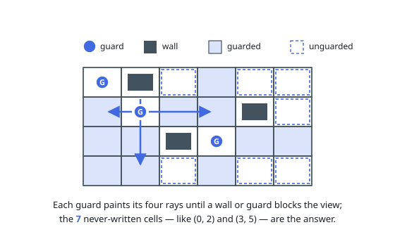

# Solutions — Count Unguarded Cells in the Grid

## Paint every line of sight, count what is left

Walls and guards first occupy their cells; a cell can then never be
counted as unguarded. Each guard's line of sight walks outward in the four
cardinal directions, marking every cell it reaches as guarded, and stops
at the first wall or fellow guard — both block the view.

Once every guard has painted its four rays, a cell is unguarded exactly
when it was never written to, so counting the untouched cells yields the
answer.

**Complexity:** `O(m·n + g·(m + n))` time, `O(m·n)` space, with `g`
guards.
