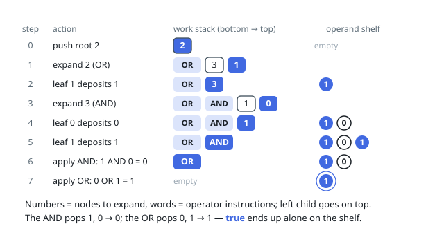

# Solutions — Evaluate Boolean Binary Tree

The tree is a formula, not a search structure: leaves carry the literals
(1 is true, 0 is false) and every internal node applies its operator —
value 2 is OR, value 3 is AND — to exactly two finished subresults.
Nothing about paths or search matters; the answer is fixed bottom-up,
and one post-order pass over the whole tree computes it. The single
solution below runs that pass on an explicit stack.

## Post-order fold on an operator shelf

Combining a node before its children finish is the only way to get this
wrong, which makes the dependency structure pure post-order — exactly
what the hints' recursive version expresses. The catch is shape: the
node budget allows spines several hundred nodes deep, past what fixed
call stacks (and Python's recursion ceiling) are willing to hold, so
the fold runs on two explicit structures instead. The work stack holds
instructions — expand this node, or apply this operator — and the
operand shelf holds finished bits. Expanding an internal node pushes
its operator first with its two children above it, left on top;
expanding a leaf just deposits its literal. Because the tree is full,
every subtree's entries net out to exactly one bit, so an operator can
only resurface once everything above it — both of its subtrees — has
collapsed; the two bits it pops then are precisely its children's
results, and the last application leaves the root's bit alone on the
shelf.

Both structures live on the heap and grow with the tree's size, never
with nesting depth; no call frame recurses at any point, so even the
deepest spine the constraints allow evaluates comfortably.

**Complexity:** `O(n)` time, `O(n)` space.
