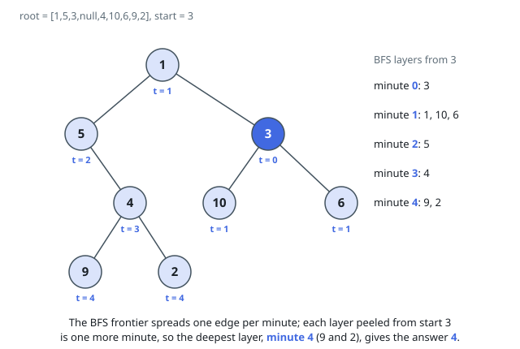

# Solutions — Amount of Time for Binary Tree to Be Infected

## Parent map plus BFS from the start node

Infection spreads one edge per minute in both directions, so the minute a
node is infected equals its graph distance from the start node once
parent edges are added. Collect the tree's edges into an undirected
adjacency map with one traversal, then run a breadth-first search from the
start value: every layer peeled off is one more minute, and the deepest
layer reached is exactly the number of minutes needed to infect the whole
tree.

Because node values are unique, values alone work as node identities and
no visited bookkeeping beyond a seen set is required.

**Complexity:** `O(n)` time, `O(n)` space.
