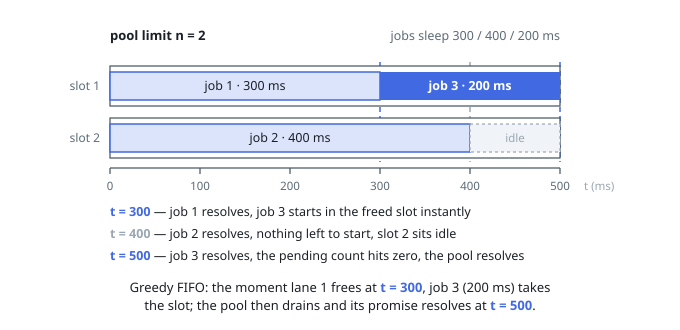

# Solutions — Promise Pool

## Greedy FIFO fill with a pending counter

The pool is one `launch` pass wrapped around a pending counter. `launch`
fills every free slot synchronously from the head of the queue — at most
`n` functions are started on that first pass, each returning a real
promise that is only ever touched through its fulfillment handler. That
handler decrements the counter and immediately calls `launch` again, so
the moment any promise settles, the lowest-indexed unstarted function
takes over its slot. Because new work starts from exactly two places (the
initial fill and a settlement), no more than `n` promises can ever be
pending, and index order of execution holds even when several promises
settle at once: every refill walks the queue front to back.

Termination is decided inside `launch`: if nothing is running and nothing
remains to start — which happens trivially for an empty input before any
await — the aggregate promise resolves right there. The function handed
to `functions[i]()` returns a fresh promise per call, so the pool never
caches or re-invokes anything, and rejections cannot surface because the
statement guarantees the inputs always fulfill.

Judged on CoderPuzzle's virtual clock, this greedy policy produces exactly the
pinned schedule: with limit `n`, job i starts when the i − n'th earlier
settlement frees its slot (or at t=0 while slots remain), and ends one
delay later.

**Complexity:** `O(m)` time and `O(n)` pending space, where `m` is
`functions.length`.
