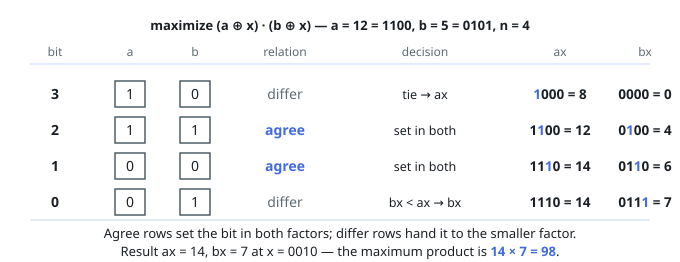

# Solutions — Maximum Xor Product

Choosing `x` bit by bit looks exponential, but the product's response to
each bit decision is locally comparable, so one greedy pass from the top
bit down is optimal.

## Greedy bit assignment from the top down

Build the two factors `ax = a ^ x` and `bx = b ^ x` while deciding `x`'s
bits from bit 49 down to bit 0. Bits at or above `n` are unreachable —
`x` is smaller than `2ⁿ` — so they simply stay as `a` and `b` have them.
Below bit `n`, two cases:

- If `a` and `b` **agree** on bit `i`, `x`'s bit can make _both_ factors
  carry the bit (set `xᵢ` opposite to that shared value). Since
  `(ax + bit)(bx + bit) − ax·bx = bit·(ax + bx) + bit² > 0`, setting the
  bit in both is always a strict win, whatever the lower bits do.
- If they **differ**, the bit can ride on exactly one factor — setting it
  in `ax` clears it from `bx` and vice versa. Comparing the partially
  built values (all higher bits are already final, so the comparison is
  the true comparison), giving the bit to the smaller factor adds
  `bit·larger` to the product while the alternative adds `bit·smaller` —
  so the smaller factor takes it, with ties free.

Each decision dominates the alternatives at its own bit height
independently of the later ones, so the walk is optimal; it also fixes
`x` itself implicitly (`x = ax ^ a`).

On widths: `a`, `b < 2⁵⁰`, so the accumulators stay below `2⁵¹` — every
comparison and add is 64-bit territory, far beyond 32-bit safety, yet far
below JavaScript's `2⁵³` exactness limit (where bitwise operators would
truncate to 32 bits anyway, so JS extracts bits by halving). The true
product reaches `2¹⁰⁰`, but only its factors are reduced first: each mod
factor is `< 2³⁰`, the reduced product `< 2⁶⁰` fits signed 64-bit, and
JavaScript performs that single oversized multiply in `BigInt`.

**Complexity:** `O(1)` time (50 fixed iterations), `O(1)` space.
