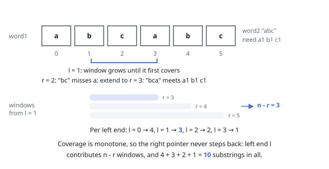

# Solutions — Count Substrings That Can Be Rearranged to Contain a String II

## Sliding window with two pointers and a fixed frequency table

A substring can be rearranged to have word2 as a prefix exactly when its
character multiset covers word2's multiset, so the task is to count, for every
left end `l`, how many right ends `r` produce a covering window. Coverage is
monotone: if `[l, r]` covers `[l, r']` with `r' > r` covers it too. That makes
a two-pointer sweep exact — advance a right pointer until the counts of all 26
letters first satisfy `count[c] >= need[c]`, then every extension of that
window is also valid, contributing `n - r` windows for this left end.

The right pointer never moves backwards: after dropping the leftmost
character of a covered (or not-yet-covered) window, the smallest covering
right end can only stay put or grow, so across the whole scan each character
enters and leaves the window at most once and the run time stays linear in
`|word1|`. The bookkeeping is two length-26 integer arrays plus a running
tally of how many required characters are still missing, which is updated by
±1 per event; no per-character map or reallocation happens inside the loop,
which matters at the top of the constraint range (`|word1| = 10⁶`,
`|word2| = 10⁴`). The answer itself can approach `n(n+1)/2 ≈ 5 × 10¹¹`, well
past 32-bit range, so it is accumulated in a 64-bit integer throughout.

In JavaScript both strings fit easily and the count stays far below 2⁵³
(the maximum possible value is about `5.000005 × 10¹¹ < 9.007 × 10¹⁵`), so an
ordinary `number` accumulates the answer exactly — no BigInt needed. Every
other language uses its native 64-bit integer type for the total.

**Complexity:** `O(|word1| + |word2|)` time, `O(1)` space.
