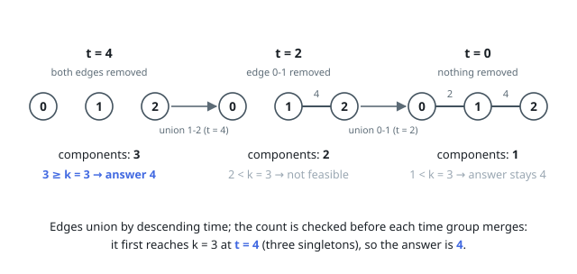

# Solutions — Minimum Time for K Connected Components

## Descending-Time Union-Find Sweep

Run Kruskal in reverse: sort the edges by removal time in descending order and union them one by one, starting from n singleton components. Just before merging the group of edges sharing time t, the union-find holds exactly the graph that remains when every edge with time ≤ t has been removed — so if the component count is already at least k at that moment, t is a feasible answer time. Since feasibility is monotone in t and can only first become true at one of the edge times (or at 0), the largest time group whose pre-merge count reaches k is the minimum feasible t, and the sweep naturally records it by overwriting the answer as times decrease.

Edges are processed grouped by equal time so that a partially merged group is never mistaken for a valid intermediate state; redundant edges inside a group (those whose union is a no-op) do not decrement the component count. Each successful union lowers the count by one, making the check a simple counter comparison rather than a graph traversal.

The final check after the loop covers the case where even the full graph — nothing removed — already has k or more components, returning 0; an empty edge list lands there immediately. Times up to 10^9 are only ever compared and sorted, so no arithmetic hazards arise.

**Complexity:** `O(m log m + n)` time, `O(n + m)` space.
