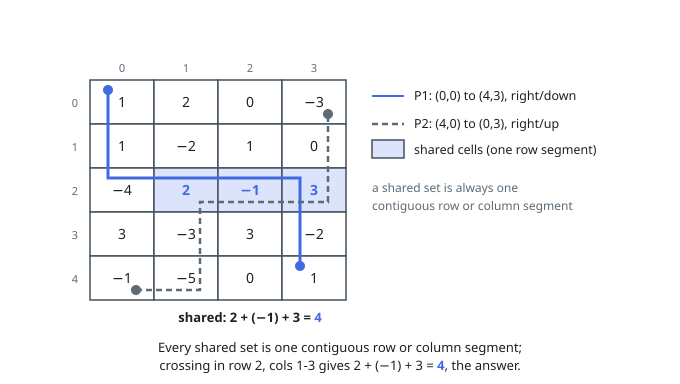

# Solutions — Maximum Path Intersection Sum in a Grid

Every shared set is either one interior cell or a contiguous row/column segment of length at least two. Scan each row and column with Kadane's recurrence while admitting candidates only after a second element, and compare them with every interior singleton.

## Row and column Kadane scans

Every shared set is either one interior cell or a contiguous row/column segment of length at least two. Scan each row and column with Kadane's recurrence while admitting candidates only after a second element, and compare them with every interior singleton.

**Complexity:** `O(mn) time, O(1) space`.
