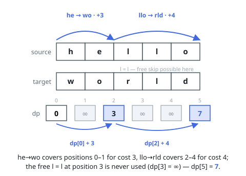

# Solutions

The solution uses prefix dynamic programming.

## Prefix dynamic programming

Let `dp[i]` be the minimum cost after exactly the first `i` positions have been finalized. If the next source and target characters already match, that position may remain unused and advance the state at no cost.

Otherwise, or in addition, test every rule at position `i`. A rule creates an edge to the end of its range only when its wildcard pattern matches the original source slice and its replacement equals the target slice; disjointness is automatic because transitions always advance to the first unused position.

**Complexity:** O(n · rules · maxPatternLength) time and O(n) space.
