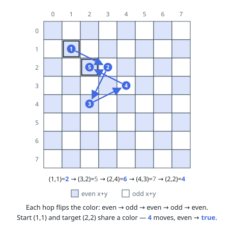

# Solutions — Even Number of Knight Moves

## Board-color parity

Color each square by the parity of `x + y`. A knight move changes `x` by two
and `y` by one, or vice versa, so every move changes the square color. Thus,
an even number of moves returns the knight to the same color, while an odd
number reaches the opposite color.

Because the knight can reach every square on an 8 by 8 board and both colors
are connected, same-color squares are exactly the even-parity destinations.

**Complexity:** `O(1)` time, `O(1)` space.
